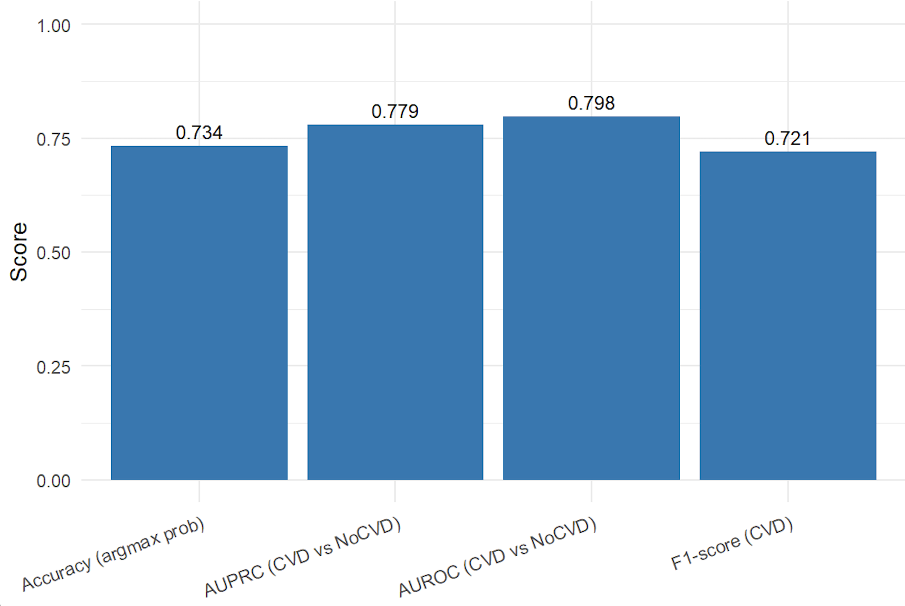

# cardioPredictR

`cardioPredictR` is an R package developed for the BIO215 Capstone
Project.  
It provides a simple and reproducible interface for predicting
**cardiovascular disease risk categories** using a trained Random Forest
model.

The model and feature engineering are identical to those used in the
accompanying Shiny application, ensuring consistent predictions across
platforms.

------------------------------------------------------------------------

## Installation

To install the package from GitHub, run:

``` r
install.packages("remotes")
remotes::install_github("HaotianYang-xjtlu/cardioPredictR")
```

------------------------------------------------------------------------

## Usage

The package exports a single main function, `predict_cvd()`.  
This function accepts a `data.frame` containing patient-level clinical features
and returns a **categorical risk prediction** (`Low Risk` or `High Risk`).

### Example

```r
library(cardioPredictR)

# Example patient data (age is measured in days)
new_patient <- data.frame(
  age = 18250,
  gender = 1,
  height = 165,
  weight = 70,
  ap_hi = 120,
  ap_lo = 80,
  cholesterol = 1,
  gluc = 1,
  smoke = 0,
  alco = 0,
  active = 1
)

# Predict cardiovascular disease risk category
predict_cvd(new_patient)

# Expected output
[1] Low Risk
Levels: Low Risk High Risk
```

------------------------------------------------------------------------

## Model performance

On the held-out test dataset, the Random Forest model achieved:

- **Accuracy:** 0.73  
- **F1-score:** 0.72  
- **AUROC:** 0.80  
- **AUPRC:** 0.78  



------------------------------------------------------------------------

## Model description

- **Algorithm:** Random Forest (implemented using the `ranger` package)  
- **Number of trees:** 1000  
- **Outcome variable:** Cardiovascular disease (CVD) status  
- **Prediction output:** Risk category (classification, not probability)  
- **Age unit:** Days (consistent with the original dataset)

------------------------------------------------------------------------

## Notes

- The `predict_cvd()` function returns **categorical risk labels**
  (`Low Risk` / `High Risk`) rather than prediction probabilities.
- The trained model is bundled within the package to ensure reproducibility
  across different computing environments.
- Input data must follow the same format as shown in the example, particularly
  with **age measured in days**.


